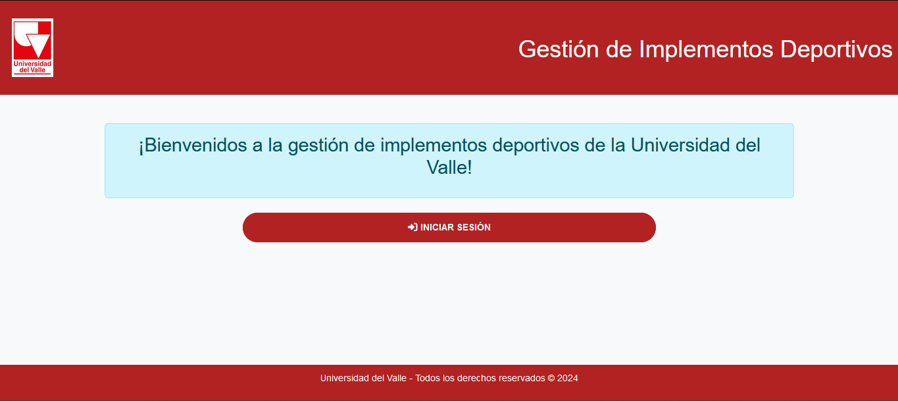
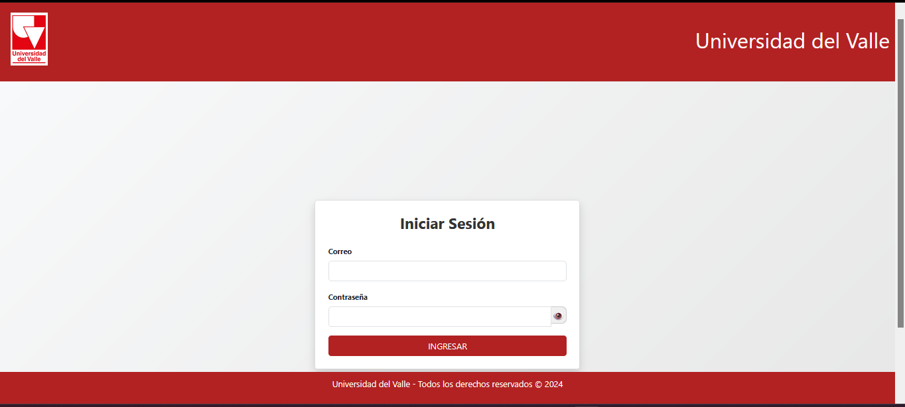
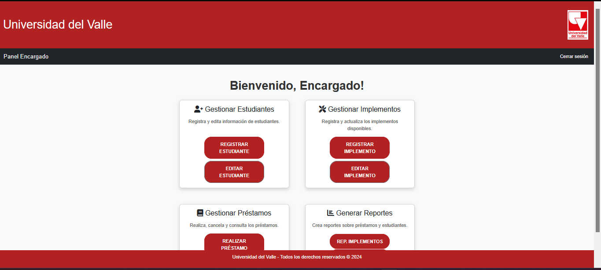
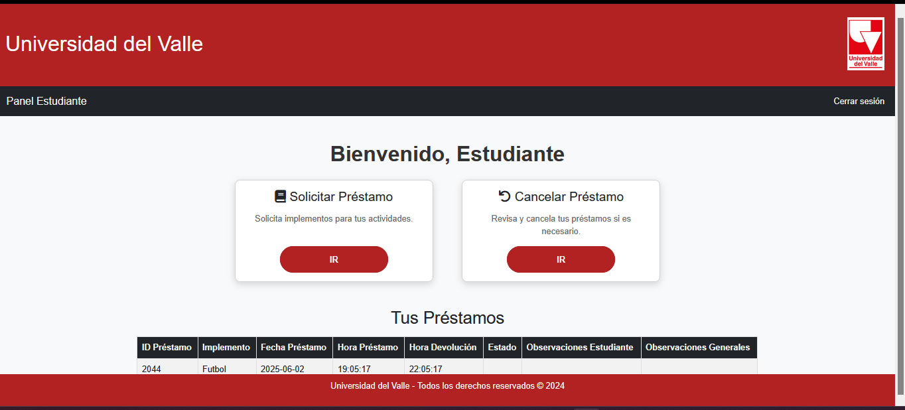
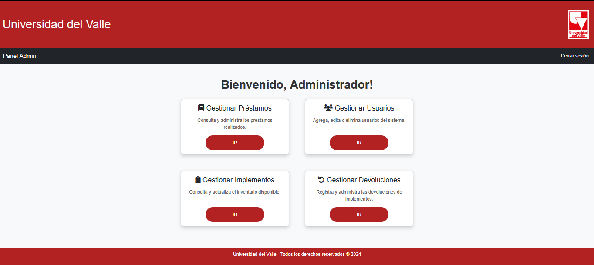
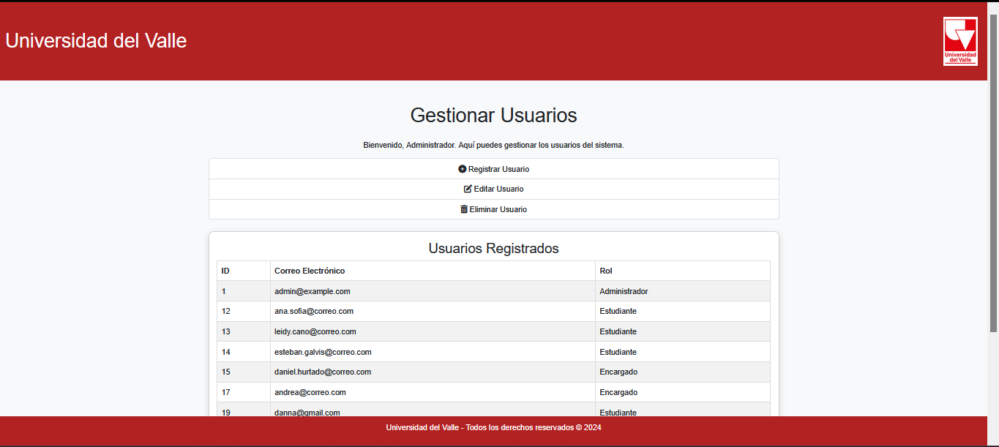
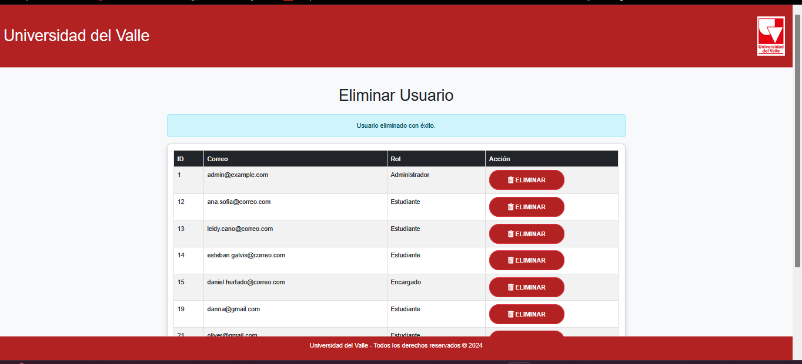

# Gestión de Implementos Deportivos - Despliegue con Docker y CI/CD

# Objetivo

Implementar un sistema web para la gestión de implementos deportivos, desplegado con Docker y automatizado con GitHub Actions. Este proyecto hace parte del módulo "Despliegue de Aplicaciones Web con Docker y CI/CD".

# Integrantes

- Ana Sofia Chocue 

- Danna Camila Flórez  

- Leidy Johanna Vareño 

- Oliver Camilo Bueno  

- Daniel Felipe Hurtado 

- Fabián Esteban Galvis 

# Tecnologías Utilizadas

- *Frontend*: HTML, PHP, CSS, Bootstrap 

- *Backend*: PHP 8.2 con Apache

- *Base de datos*: MySQL 8.0  

- *Contenerización*: Docker, Docker Compose  

- *CI/CD*: GitHub Actions

Este stack tecnológico fue elegido para facilitar el desarrollo rápido, contenerización ligera y despliegue automatizado, asegurando portabilidad y facilidad de mantenimiento.

# Despliegue Local

# 1. Clonar el repositorio

git clone https://github.com/AnaaS27/Gestion-de-Implementos-Deportivos.git

cd Gestion-de-Implementos-Deportivos

# 2. Construir y levantar los contenedores

docker compose up -d --build

Este comando construye las imágenes Docker para la aplicación y la base de datos, y levanta los contenedores en segundo plano

# 3. Acceder a la aplicación

Para ingresar la aplicacion se usa la siguiente url:
http://localhost:8080

# Configuración de la Base de Datos

Host: db

Usuario: usuario

Contraseña: clave123

Base de datos: gestion_deportiva

La base de datos se inicializa automáticamente al levantar los contenedores, gracias al script init.sql ubicado en el directorio docker/mysql/init.sql. Este script crea las tablas y datos iniciales necesarios para la aplicación.

# Pipeline CI/CD

El repositorio incluye un pipeline de integración continua utilizando GitHub Actions ubicado en .github/workflows/deploy.yml, el cual realiza las siguientes tareas:

    Verificación y análisis estático del código PHP para detectar errores comunes.

    Construcción de imágenes Docker y despliegue automatizado a un entorno de producción o staging.

El pipeline se ejecuta automáticamente en cada push al repositorio, ayudando a mantener la calidad del código y acelerar el proceso de despliegue

# Capturas de Pantalla

# Notas Finales

Las credenciales están definidas como variables de entorno en docker-compose.yml.

El entorno fue probado en Ubuntu con Docker Desktop.

El pipeline de GitHub Actions se ejecuta automáticamente al hacer push.